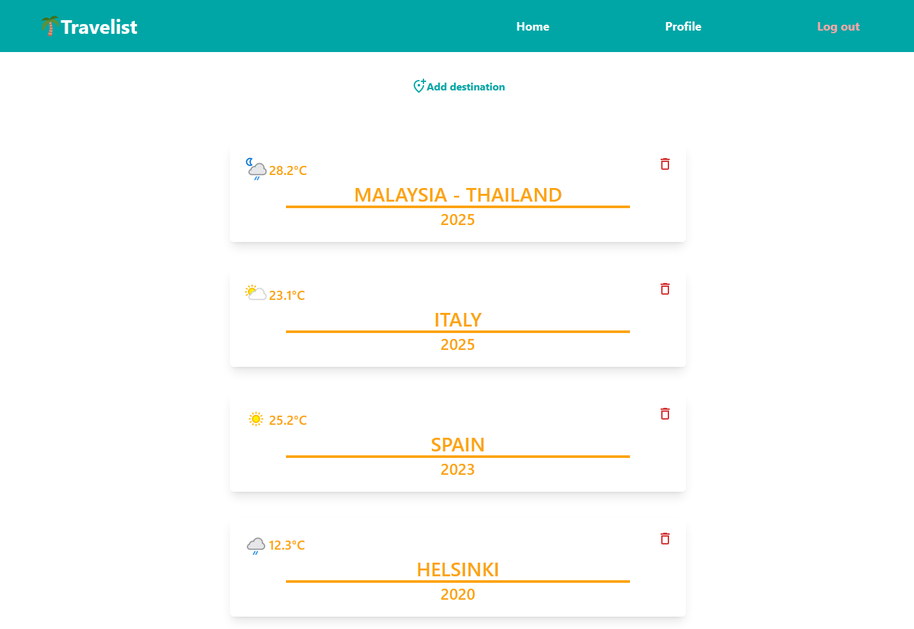
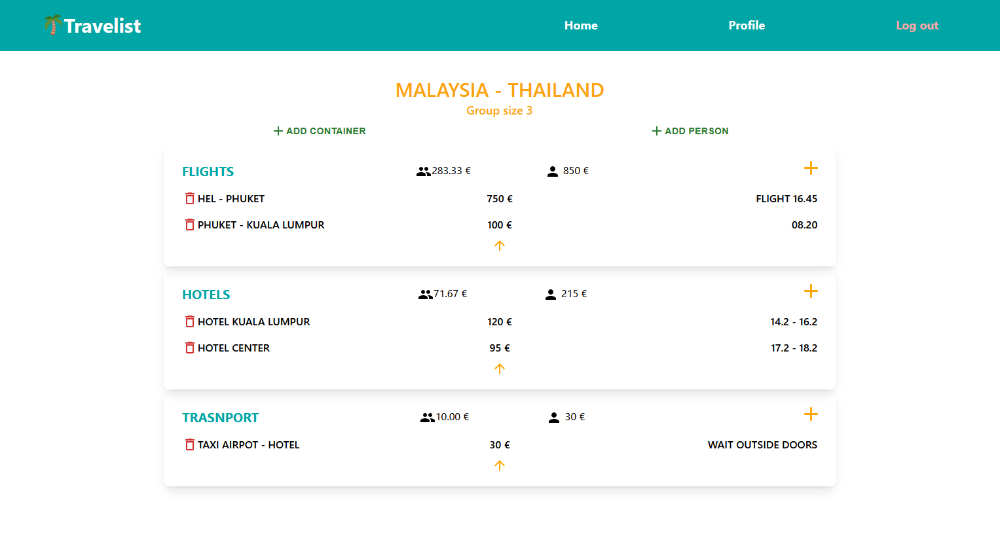

# 🌴 Travelist

Travelist on web-sovellus, jonka avulla käyttäjät voivat suunnitella ja budjetoida matkoja ystäviensä kanssa. Sovellus käyttää Firebasea kirjautumiseen ja tietojen tallennukseen, ja on rakennettu Reactin ja TypeScriptin avulla.




## 🔧 Teknologiat

- [React](https://reactjs.org/)
- [TypeScript](https://www.typescriptlang.org/)
- [Tailwind CSS](https://tailwindcss.com/)
- [Firebase Auth](https://firebase.google.com/docs/auth)
- [Firebase Realtime Database](https://firebase.google.com/products/realtime-database)
- [React Router](https://reactrouter.com/)

## 🚀 Ominaisuudet

- Käyttäjän kirjautuminen Google-tilillä (Firebase Auth)
- Oman matkasuunnitelman luominen ja tallentaminen
- Budjetointi ja kustannusten seuranta
- Mahdollisuus jakaa matka ystävien kanssa

## 📦 Asennus

1. Kloonaa repositorio:

```bash
git clone https://github.com/ilarikoik/travelist.git
cd travelist

npm install

Luo config.tsx tiedosto

const config = {
  REACT_APP_API_KEY: "your_api_key",
  REACT_APP_AUTH_DOMAIN: "AUTH_DOMAIN",
  REACT_APP_PROJECT_ID: "PROJECT_ID",
  REACT_APP_STORAGE_BUCKET: "STORAGE_BUCKET",
  REACT_APP_MESSAGING_SENDER_ID: "MESSAGING_SENDER_ID",
  REACT_APP_APP_ID: "APP_ID",
};

npm run dev

```
